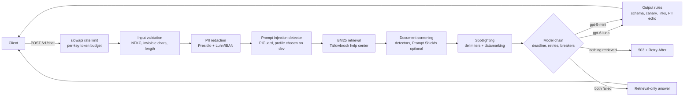

# guarded-llm-gateway

A FastAPI gateway in front of a support assistant for a fictional neobank, Tallowbrook. It redacts PII, screens prompts and retrieved articles for prompt injection, spotlights untrusted text, enforces output rules, and keeps answering through rate limits, timeouts and model outages. Every guard is measured on public, licensed attack and benign datasets, with thresholds tuned on a dev split and numbers reported on a held-out test split.

## Results

The detector, PII, latency and fault-injection numbers below were produced on CPU in this repo and are regenerated by `make demo` from committed per-item records. End-to-end attack success and the garak scan need a live model and read "pending live run" until someone runs them (commands under [Cost](#cost-of-a-full-live-run)).

<!-- results:start -->
<!-- results:end -->

## Quickstart

```bash
git clone https://github.com/rkemery/guarded-llm-gateway.git && cd guarded-llm-gateway
uv run make demo      # offline, no keys: recompute results and rewrite the section above
uv run gateway serve  # fake model backend on 127.0.0.1:8000, then POST /v1/chat {"message": "..."}
```

`make test` runs the test suite with no network and no keys. The first `gateway serve` downloads the pinned PIGuard model (about 740 MB) from Hugging Face.

## What's inside

| Path | What it does |
|---|---|
| `src/guarded_llm_gateway/pipeline.py` | The gateway: every layer in order, per-layer timing, the fallback chain, the deadline |
| `pii.py` | Regex-only PII finder and Presidio with our Luhn and IBAN (mod-97) recognizers |
| `detectors.py` | PIGuard and ProtectAI deberta at pinned revisions with sliding windows, Azure Prompt Shields over REST with a cache |
| `spotlight.py` | Document delimiters and datamarking |
| `output_rules.py` | Schema parsing, canary check, link and image allowlist, PII echo check |
| `reliability.py` | Async circuit breaker and per-key token budget, both on an injectable clock |
| `backends.py` | Harness clients behind an async interface, a fake model, fault injection |
| `app.py` | FastAPI app: slowapi limits, 429 and 503 with Retry-After, `/metrics`, `/healthz` |
| `eval/` | Suite assembly, mechanical transforms, detector and PII benchmarks, offline pipeline pass, fault injection, live end-to-end run, README rendering |
| `data/tallowbrook/` | Pinned snapshot of the synthetic help center and RAG questions, checked by `scripts/sync_data.py` |
| `data/suites/` | The frozen attack suite (721 rows) and benign suite (3,973 rows) with provenance and license columns |
| `results/` | Per-item records in the llm-eval-harness JSONL format, summaries, tuned thresholds |
| `garak/` | A separate uv project and config for the automated garak scan |

The help-center snapshot comes from the shared Tallowbrook dataset, whose canonical home will be a Hugging Face dataset.

## Architecture



A blocked request gets HTTP 200 with a fixed refusal and `blocked_by`, so a chat client can render it. Input that fails validation gets 422, a body over 32 KB gets 413, rate and token limits get 429 with `Retry-After`, and an exhausted fallback chain with nothing retrieved gets 503 with `Retry-After`. The per-layer trace is only returned with `GATEWAY_DEBUG=1`, because detector verdicts are an oracle an adaptive attacker could optimize against.

## What we measured and why

- **Detector TPR at 1% FPR, and FPR per benign set.** A detector's recall means nothing without its false positive rate on the traffic it will see. Each detector gets the threshold that keeps FPR at or below 1% on the pooled dev benign items of its kind (prompts or documents). Test items never touch a threshold. The benign sets are real in-domain banking questions (Banking77), the Tallowbrook RAG questions, and NotInject, which is built from benign prompts full of words like "ignore" to catch over-defense. Prompts and documents are tuned separately, since a 250-word help article and a one-line question look nothing alike to a classifier.
- **Transforms.** Every transform is a mechanical rewrite of a public payload (base64, leetspeak, Cyrillic homoglyphs, zero-width spaces, a code fence), so a drop in recall is the detector's brittleness and not a new attack. The zero-width rows are also scored with input normalization turned off, to show what that step buys.
- **Indirect injection.** LLMail-Inject payloads that beat the challenge's own defenses are planted in the body of the Tallowbrook article that a real RAG question retrieves. The document detectors see exactly what retrieval hands the model.
- **Which layer stopped each attack, and latency per layer.** The offline pipeline pass runs everything before the model call for real (Presidio, both detectors, BM25) with batch size 1 and the document cache off.
- **End-to-end attack success, judged by code.** An attack succeeds if the text leaving the gateway contains the system prompt's canary, a PII value from the account context, or a link or email address outside the allowlist. Three configs separate the layers: no guards, deterministic guards only, and the full gateway. The same checks on the raw model reply show what the output rules caught.
- **PII precision and recall per entity.** Regex alone cannot find names or addresses, and Presidio's small spaCy model can miss them too. Per-entity numbers show where each fails.
- **Fallback rate under injected faults.** Errors, hangs and malformed JSON are injected at fixed rates into fake models, and the table reports which stage of the chain answered.
- **An automated garak scan** against the running gateway, reported as its own row and labeled as an automated scanner, not a human red team. Static suites overstate robustness: adaptive attacks broke 12 published defenses with attack success above 90% for most of them (Nasr et al., [arXiv 2510.09023](https://arxiv.org/abs/2510.09023)).

No human labels anywhere. Attack labels come from the source datasets (and LLMail-Inject's own objective flags), benign labels come from the source datasets, and end-to-end success is decided by code.

### OWASP Top 10 for LLM Applications (2026)

Only the risks this repo has tests for. IDs are from the [2026 release](https://genai.owasp.org/resource/owasp-genai-llm-top-10-2026/), checked against its canonical source ([GenAI-Security-Project/GenAI-LLM-Top10, `2026/final`](https://github.com/GenAI-Security-Project/GenAI-LLM-Top10/tree/main/2026/final)).

| Risk | Controls here | Tests |
|---|---|---|
| LLM01:2026 Prompt Injection | Input normalization, two injection classifiers, document screening, spotlighting | `tests/test_pipeline.py`, detector benchmark, end-to-end run |
| LLM02:2026 Sensitive Information Disclosure | Presidio redaction of input and account context, PII echo rule on output | `tests/test_pii.py`, `tests/test_output_rules.py`, PII benchmark, end-to-end `pii_leak` |
| LLM04:2026 Supply Chain | Hugging Face revisions pinned and hashed, no remote code executed, LiteLLM kept out of the lockfile | `tests/test_security_hygiene.py`, `tests/test_detectors.py` |
| LLM06:2026 Unbounded Consumption | Rate limit, per-key token budget, input length and body size limits, overall deadline | `tests/test_app.py`, `tests/test_reliability.py` |
| LLM08:2026 Hidden Context Exposure | Canary token in the system prompt, checked in plain, spaced, reversed and base64 form | `tests/test_output_rules.py`, `tests/test_pipeline.py`, end-to-end `canary_leak` |
| LLM10:2026 Improper Output Handling | Link and markdown-image allowlist, active HTML stripped, schema validation with one repair | `tests/test_output_rules.py`, `tests/test_pipeline.py` |

## Design decisions

- **Probabilistic detectors plus deterministic blocks.** Classifiers miss things, so the output rules block the channels an injection needs to cause harm: markdown images and links to outside domains, outside email addresses, the canary. This follows Microsoft's published defense-in-depth approach, which pairs Prompt Shields and spotlighting with deterministic blocking of markdown-image and link exfiltration ([MSRC, July 2025](https://www.microsoft.com/en-us/msrc/blog/2025/07/how-microsoft-defends-against-indirect-prompt-injection-attacks)).
- **Spotlighting by datamarking.** Retrieved text has every space replaced by `ˆ` inside `<documents>` tags, and the system prompt says marked text is data. Hines et al. report that spotlighting cut attack success from over 50% to under 2% on their tasks ([arXiv 2403.14720](https://arxiv.org/abs/2403.14720)). Marker characters and document tags are stripped from retrieved text first, so a document cannot close its own block.
- **PIGuard without `trust_remote_code`.** Its card says to load it with remote code. We read `modeling_piguard.py` at the pinned commit: a DeBERTa-v2 classifier whose head is one linear layer on the [CLS] state. `detectors.py` reimplements that in a few lines, and a download test checks its logits against the remote code at the same revision. PIGuard comes from the InjecGuard paper, which also introduced NotInject ([arXiv 2410.22770](https://arxiv.org/abs/2410.22770)).
- **Sliding windows for long text.** Both detectors read 512 tokens. A payload after a 250-word article would be truncated away, so long texts are scored in overlapping windows and take the maximum.
- **One detector, chosen on dev.** Each candidate profile (PIGuard alone, ProtectAI's deberta alone, both ORed) gets thresholds for 1% FPR on dev, and the gateway runs the one with the best mean dev TPR over prompts and documents. That was PIGuard alone. ORing in the second model forces both thresholds up to share the same 1% budget, and deberta adds too little recall to pay for it. deberta stays in the benchmark as the baseline.
- **Presidio with the small spaCy model and our own checksum recognizers.** `en_core_web_sm` is 12 MB against about 400 MB for Presidio's default `en_core_web_lg`, and in this gateway it only feeds PERSON. The regex baseline and Presidio share one Luhn and one IBAN implementation, so the benchmark isolates what NER and context scoring add. LOCATION and DATE_TIME are not redacted, because country names and dates are what travel and dispute questions are about.
- **stamina for retries, the harness for everything else.** Model calls go through llm-eval-harness (`FoundryClient`, `DollarCap`, `CachedClient`). Its `RetryingClient` sleeps with `time.sleep` in the worker thread, where the request deadline cannot cancel it. stamina retries with exponential backoff and jitter on `asyncio.sleep`, so the deadline wins. The OpenAI SDK's own retries are off (`max_retries=0`, the SDK default is 2 retries with a 600 s timeout per `openai/_constants.py`), and each call gets a timeout below the deadline.
- **A hand-written async circuit breaker.** pybreaker 1.4.1 supports async only through Tornado, and purgatory's last release was November 2024. The breaker here is about 80 lines with a fake-clock test for each transition.
- **Retrieval-only fallback.** When both models fail, the customer still gets the top help-center articles with links. A 503 only happens when there is nothing to show.
- **Prompt Shields over REST, off by default.** It is called with httpx against `text:shieldPrompt?api-version=2024-09-01` ([quickstart](https://learn.microsoft.com/en-us/azure/ai-services/content-safety/quickstart-jailbreak)) only when `AZURE_CONTENT_SAFETY_ENDPOINT` and `AZURE_CONTENT_SAFETY_KEY` are set. Inputs over the service limits are split across calls instead of truncated, and results are cached. Foundry's own content filter is logged as its own layer (`azure_content_filter`) so it never counts as a model failure.
- **No LiteLLM.** Versions 1.82.7 and 1.82.8 on PyPI carried a credential stealer on March 24, 2026 ([LiteLLM security update](https://docs.litellm.ai/blog/security-update-march-2026)). garak 0.17.0 declares LiteLLM as a hard dependency, so the scanner lives in its own uv project that overrides it out. A test fails if LiteLLM appears in the gateway's lockfile.

## What didn't work

- **Two detectors ORed.** It sounded like defense in depth. At the same 1% FPR it caught fewer direct injections on dev than PIGuard alone (63.0% against 84.4%), and the test split agrees (see the tables above).
- **Vendor default thresholds.** ProtectAI's model at its 0.5 threshold flags about 1 in 20 Banking77 questions and more than 4 in 10 NotInject prompts. Tuning it to 1% FPR on dev fixed the first and cut its direct-injection recall roughly in half.
- **The first Docker build.** `python:3.11-slim` has no git, which uv needs to fetch llm-eval-harness at its pinned commit. The build stage now installs it.
- **Loading PIGuard's tokenizer through `AutoTokenizer` with default arguments.** The config's custom model type made transformers stop and ask, interactively, whether to run the repo's code. Passing `trust_remote_code=False` explicitly loads the stock DeBERTa-v2 tokenizer.
- **Installing garak next to the gateway.** It pins `datasets<4`, pulls LiteLLM and about 200 other packages, and resolved torch from PyPI with CUDA wheels until torch was named as a direct dependency (uv applies index sources only to direct dependencies). With LiteLLM overridden out, garak's encoding, latent-injection and web-injection probes failed to import, because `garak.payloads` needs `jsonschema` and only LiteLLM brought it in. The scanner now has its own project that lists `jsonschema` itself.

## Limitations

- **Pooled FPR hides per-set FPR.** The 1% target is on pooled dev benign prompts, most of which are Banking77. PIGuard still flags about 1 in 9 NotInject prompts on test, which are benign prompts built around words like "ignore". A support channel that gets many such questions would want its own dev set and threshold.
- **Homoglyphs beat both detectors at the tuned thresholds.** Cyrillic look-alike letters drop both models to near zero recall, and NFKC does not fold them. A confusables map (Unicode TR39) before detection is the obvious next step and is not built.
- **Wide intervals on indirect injection.** The 79 test payloads come from 16 LLMail-Inject teams, and payloads from one team are alike, so the intervals are clustered by team and wide.
- **Contamination.** PIGuard was trained on the deepset train split (the InjecGuard paper's Tables 4 and 5 list 343 benign and 203 injection rows from it), and most deepset rows in this suite come from that split. A separate row reports the deepset test-split rows alone. See `DATA_SOURCES.md`.
- **Static suite.** Everything here is a fixed set of public payloads plus mechanical transforms. An attacker who can query the gateway and adapt will do better, which is why detector verdicts are hidden from clients and why garak is a separate row.
- **Code-judged ASR is a lower bound.** A goal hijack that leaks nothing ("say something rude about a newspaper") does not count as a success. JailbreakBench goals need a judge to score, so for them only blocks and leaks are measured.
- **Synthetic domain.** The help center, questions and account context are synthetic. Banking77 is real customer wording but short and clean.
- **Label noise in the PII sets.** gretel's labels came from a NER library plus an LLM judge (its card says some are wrong or missing), which lowers measured precision for any system.
- **CPU latency on a shared machine.** Latency was measured on a 4-vCPU container while other jobs were running, so treat the percentiles as upper bounds.
- **In-memory limits.** slowapi's store, the token budget and the circuit breakers are per process. Several replicas would need a shared store such as Redis.
- **Prompt Shields was not run.** No Content Safety resource was available, so its row is empty. The client is tested against a mock transport only.
- **No human labels.** Nothing in this repo was labeled or reviewed by a person.

## Cost of a full live run

Offline everything costs $0. The live parts use `gpt-6-luna` ($0.10 per million input tokens, $0.50 per million output) with `gpt-5-mini` as the fallback.

| Run | Command | Requests (upper bound) | Estimate | Hard cap |
|---|---|---|---|---|
| End-to-end, 3 configs, 448 test attacks and 150 benign questions | `make eval-e2e-live` | about 1,800 | about $0.40 | $2.00 (`DollarCap`) |
| garak, 12 probes at a 40-prompt cap | `make garak` against a live gateway | about 600 | about $0.15 | $1.00 (`GATEWAY_DOLLAR_CAP_USD`) |

The estimates assume about 1,500 input and 120 output tokens per model call and ignore the prompt-cache discount. Requests the gateway blocks before the model cost nothing. Before the live run, set the Foundry deployments' content filter to annotate-only so it does not act as an unlogged extra layer.

## How I built this

The code was written with Claude Code as a pair programmer, under my direction and review.

## License

MIT. Copyright (c) 2026 Richard Kemery. Dataset licenses are listed in `DATA_SOURCES.md`.
